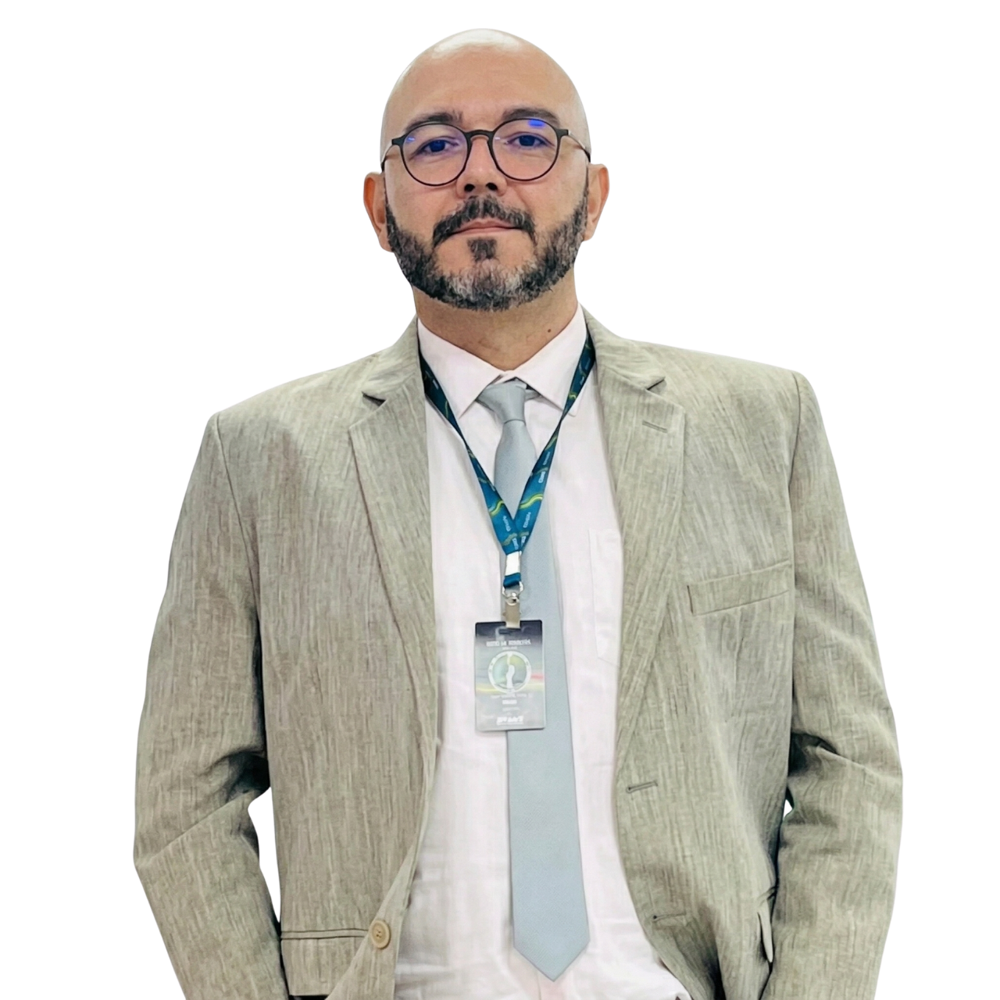
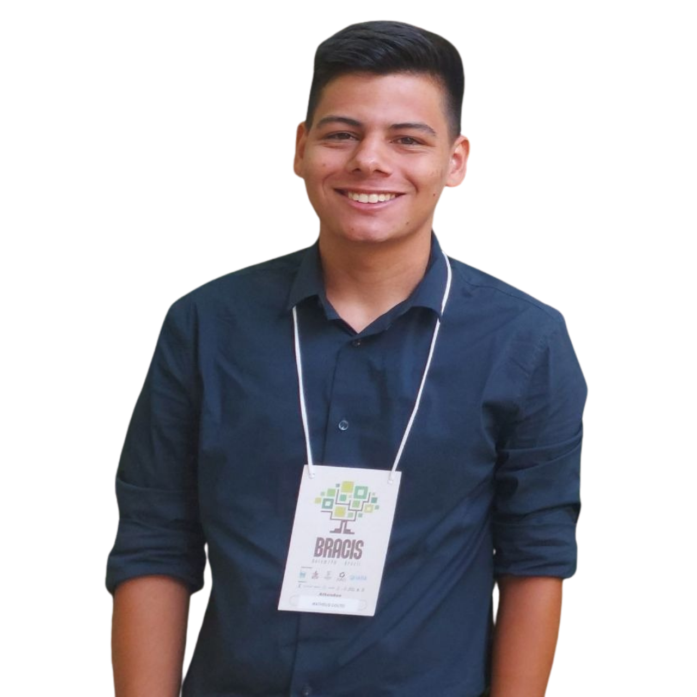
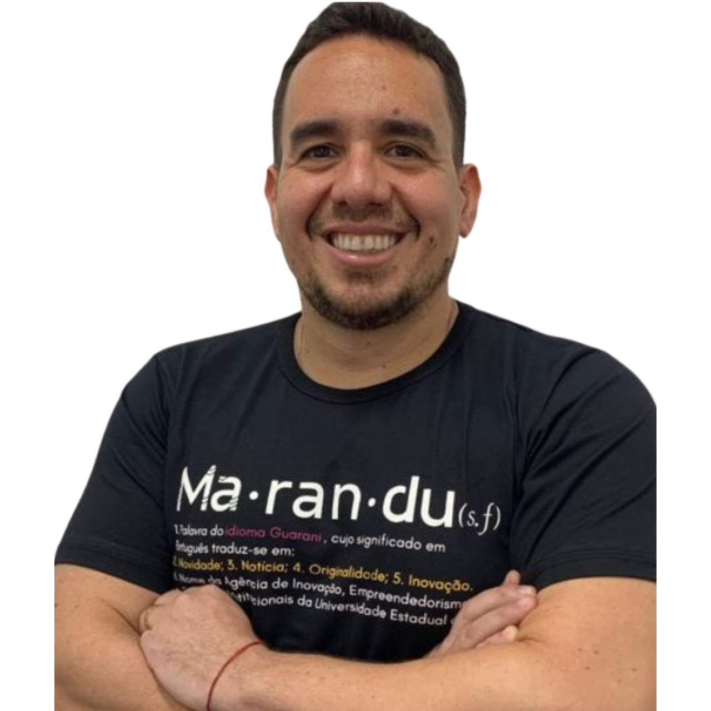
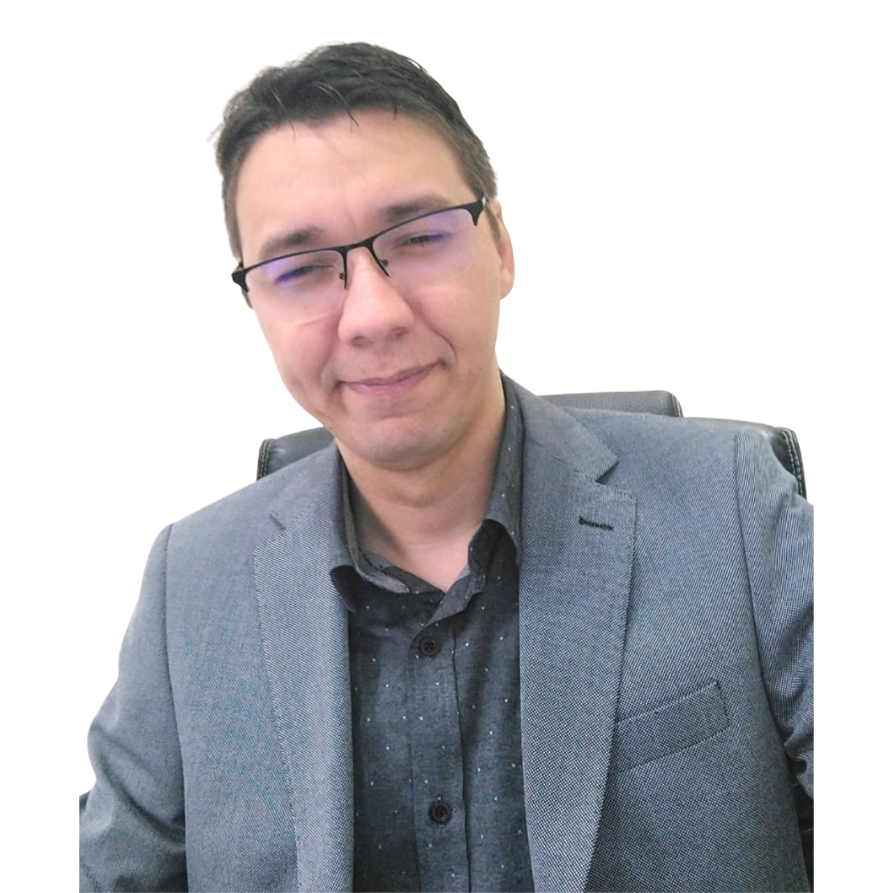
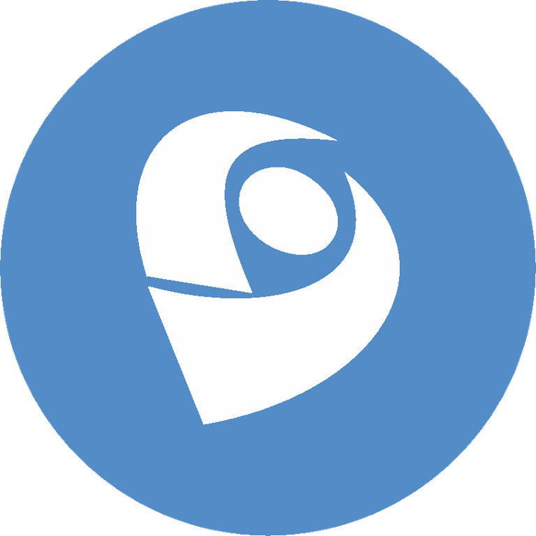

# Ferramentas de Inteligência Artificial para suporte ao processo de pesquisa em Sistemas de Informação

[](https://sbsi.sbc.org.br/)
[](https://creativecommons.org/licenses/by-nc/4.0/deed.pt-br)

> Minicurso sobre uso ético e efetivo de Inteligência Artificial e Large Language Models (LLMs) no ciclo de vida da pesquisa científica.

## Sobre o Minicurso

A ascensão da Inteligência Artificial (IA), impulsionada por Modelos de Linguagem de Grande Escala (LLMs), está transformando a pesquisa científica, gerando um volume exponencial de publicações e um novo ecossistema de ferramentas de apoio. No entanto, muitos pesquisadores ainda desconhecem como integrar essas tecnologias de forma eficaz e ética ao seu fluxo de trabalho. Este minicurso introdutório visa preencher essa lacuna, instrumentalizando a comunidade de Sistemas de Informação (SI) com ferramentas e boas práticas para apoiar todo o ciclo de vida da pesquisa com IA. Com uma abordagem eminentemente prática e hands-on, os participantes explorarão desde conceitos fundamentais de LLMs até o uso de plataformas como Research Rabbit para recuperação de literatura e NotebookLM para análise. Serão abordadas técnicas de engenharia de prompts para utilizar LLMs  como assistentes na ideação, na escrita científica e na reprodutibilidade. Um eixo central do minicurso será a discussão dos desafios éticos e de transparência, culminando na construção colaborativa de um guia de boas práticas. Espera-se capacitar os participantes a aplicar a IA de forma produtiva, crítica e íntegra em suas investigações, com material de apoio acessível que contemple o caráter inter e transdisciplinar da área de SI.

### Objetivos

- Fornecer uma visão geral das ferramentas de IA para suporte à pesquisa científica
atualmente existentes;
- Apresentar aplicações de modelos de IA generativa que demonstrem seu potencial
para auxiliar no fazer científico;
- Promover uma discussão aprofundada sobre as implicações éticas, de transparência
e de reprodutibilidade associadas ao uso da IA na pesquisa;
- Oferecer demonstrações práticas e casos de uso de como essas ferramentas podem
ser aplicadas para resolver desafios específicos da pesquisa em SI, fortalecendo o
rigor metodológico da comunidade;
- Preparar o novo pesquisador para o futuro presente da Pesquisa em SI, promovendo
a fluência no uso de ferramentas de IA, competência necessária neste novo mundo.


## Estrutura do Repositório


```text
├── revisao-da-literatura/        # Prompt de imersão em um tema
├── desenho-de-pesquisa/          # Prompts e exemplos para pergunta de pesquisa, survey e ameaça à validade
├── conducao-da-pesquisa/         # Prompts para extração de passos e replicação de experimentos
├── publicacao/                   # Prompts para revisão da escrita e indicação de locais de publicação
├── slides-aulas/                 # Apresentações dos slides do minicurso
├── LICENSE.md                    # Licença CC BY-NC 4.0
└── README.md                     # Este arquivo
```


## Autores

<table align="center">
  <tr>
    <td align="center" width="180"></td>
    <td align="center" width="180"></td>
    <td align="center" width="180"></td>
    <td align="center" width="180"></td>
    <td align="center" width="180"></td>
    <td align="center" width="180"></td>
  </tr>
  <tr>
    <td align="center"><strong>Fábio Lobato</strong></td>
    <td align="center"><strong>Matheus Couto</strong></td>
    <td align="center"><strong>Antonio Jacob Jr</strong></td>
    <td align="center"><strong>René Santin</strong></td>
    <td align="center"><strong>Solange Rezende</strong></td>
    <td align="center"><strong>Ricardo Marcacini</strong></td>
  </tr>
  <tr>
    <td align="center">
      <a href="http://lattes.cnpq.br/8320014491229434"></a>
      <a href="https://www.linkedin.com/in/lobatofabiof/"></a>
    </td>
    <td align="center">
      <a href="http://lattes.cnpq.br/0060847588752899"></a>
      <a href="https://www.linkedin.com/in/matheus-couto-985245290/"></a>
    </td>
    <td align="center">
      <a href="http://lattes.cnpq.br/4510520291728075"></a>
      <a href="https://www.linkedin.com/in/jacob-jr-744946208/"></a>
    </td>
    <td align="center">
      <a href="http://lattes.cnpq.br/8967108715703055"></a>
      <a href="https://www.linkedin.com/in/rene-santin-6b40802/"></a>
    </td>
    <td align="center">
      <a href="http://lattes.cnpq.br/8526960535874806"></a>
      <a href="https://www.linkedin.com/in/solangerezende/"></a>
    </td>
    <td align="center">
      <a href="http://lattes.cnpq.br/3272611282260295"></a>
      <a href="https://www.linkedin.com/in/marcacini/"></a>
    </td>
  </tr>
</table>


